<!-- Banner Image -->
[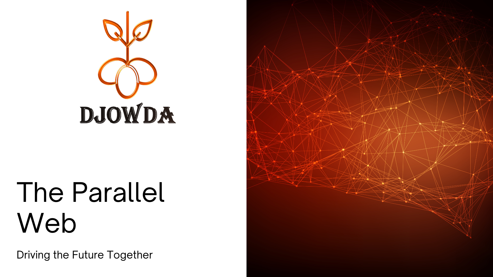](https://github.com/Moses-Code-Dev/Djowda-Platform)  

  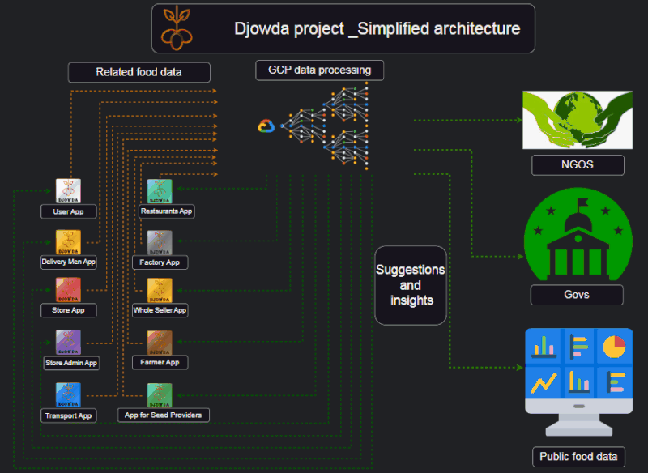

<!-- Project Description -->
[**Djowda Project** - *Empowering a World Without Hunger*](https://github.com/Moses-Code-Dev/Djowda-Platform)  

In a world where food insecurity, poverty, and starvation impact millions, the [Djowda](https://github.com/Moses-Code-Dev/Djowda-Platform) project was founded with a mission to change the narrative. By addressing the systemic challenges in food distribution and accessibility, [Djowda](https://github.com/Moses-Code-Dev/Djowda-Platform) seeks to redefine the role of food as a basic human necessity, rather than a pure commodity.

The [Djowda](https://github.com/Moses-Code-Dev/Djowda-Platform) platform aims to empower all stakeholders across the food supply chain by providing a comprehensive, free-to-use ecosystem of tools and resources. From farmers and wholesalers to store managers and end-users, [Djowda](https://github.com/Moses-Code-Dev/Djowda-Platform) offers an integrated data exchange network designed to foster collaboration, transparency, and resilience.

We are calling on developers worldwide to join us in this challenge. Through collective innovation and shared responsibility, we believe we can build a platform that supports a fair and sustainable food system for everyone.

With the right collaboration and support, we aim to launch the pilot deployment by mid-next year. If successful, [Djowda](https://github.com/Moses-Code-Dev/Djowda-Platform) has the potential to accelerate global efforts toward achieving [SDG2](https://www.un.org/sustainabledevelopment/hunger/) (Zero Hunger), potentially moving the deadline closer by one or two years.

Join us in building a future where food security is a universal right, and help us drive the change needed to make it a reality. Together, we can achieve a world without hunger.

---

<!-- Grid of Apps -->
<table>
  <tr>
    <td align="center">
      <a href="https://github.com/Moses-Code-Dev/Djowda-UserApp">
        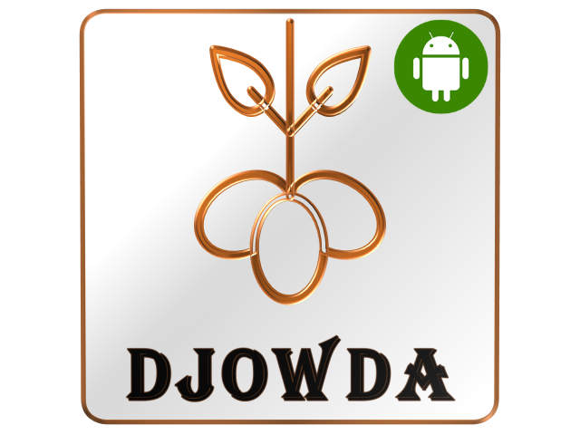
      </a>
       <a href="https://github.com/Moses-Code-Dev/Djowda-UserApp">User App</a>
    </td>
    <td align="center">
      <a href="https://github.com/Moses-Code-Dev/Djowda-DeliveryApp">
        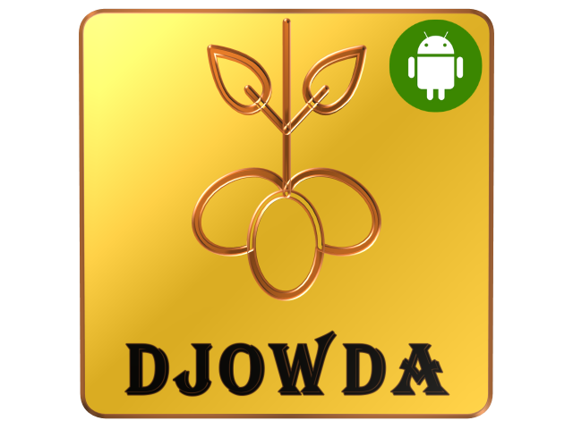
      </a>
       <a href="https://github.com/Moses-Code-Dev/Djowda-DeliveryApp">Delivery Men App</a>
    </td>
    <td align="center">
      <a href="https://github.com/Moses-Code-Dev/Djowda-StoreApp">
        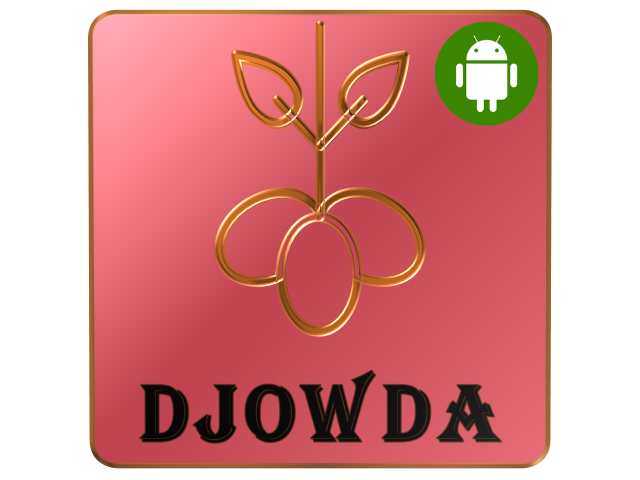
      </a>
       <a href="https://github.com/Moses-Code-Dev/Djowda-StoreApp">Store App</a>
    </td>
    <td align="center">
      <a href="https://github.com/Moses-Code-Dev/Djowda-AdminApp">
        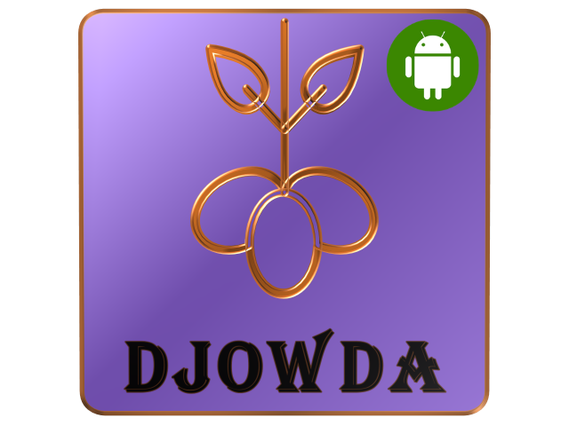
      </a>
       <a href="https://github.com/Moses-Code-Dev/Djowda-AdminApp">Store Admin App</a>
    </td>
    <td align="center">
      <a href="https://github.com/Moses-Code-Dev/Djowda-TransportApp">
        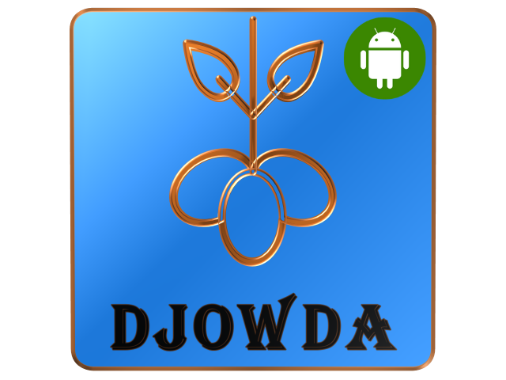
      </a>
       <a href="https://github.com/Moses-Code-Dev/Djowda-TransportApp">Transport App</a>
    </td>
  </tr>
  <tr>
    <td align="center">
      <a href="https://github.com/Moses-Code-Dev/Djowda-RestaurantsApp">
        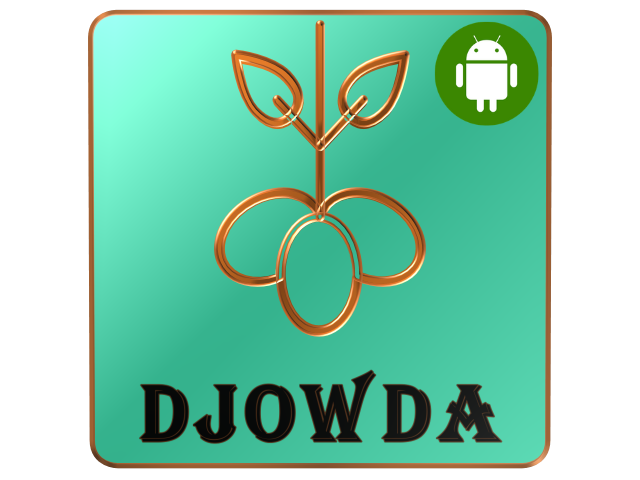
      </a>
       <a href="https://github.com/Moses-Code-Dev/Djowda-RestaurantsApp">Restaurants App</a>
    </td>
    <td align="center">
      <a href="https://github.com/Moses-Code-Dev/Djowda-FactoryApp">
        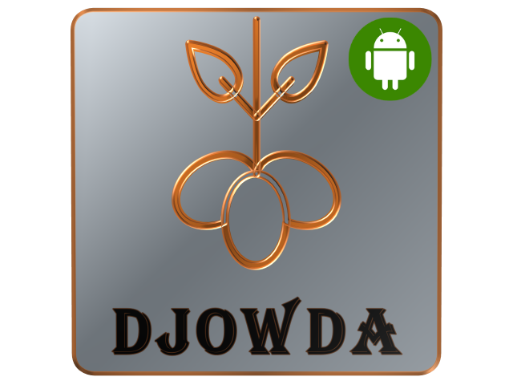
      </a>
       <a href="https://github.com/Moses-Code-Dev/Djowda-FactoryApp">Factory App</a>
    </td>
    <td align="center">
      <a href="https://github.com/Moses-Code-Dev/Djowda-WholesalerApp">
        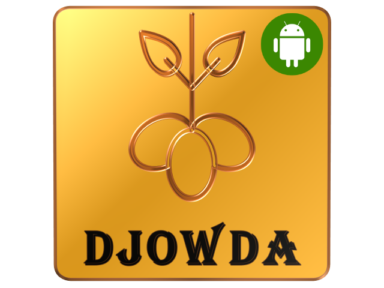
      </a>
       <a href="https://github.com/Moses-Code-Dev/Djowda-WholesalerApp">Whole Seller App</a>
    </td>
    <td align="center">
      <a href="https://github.com/Moses-Code-Dev/Djowda-FarmerApp">
        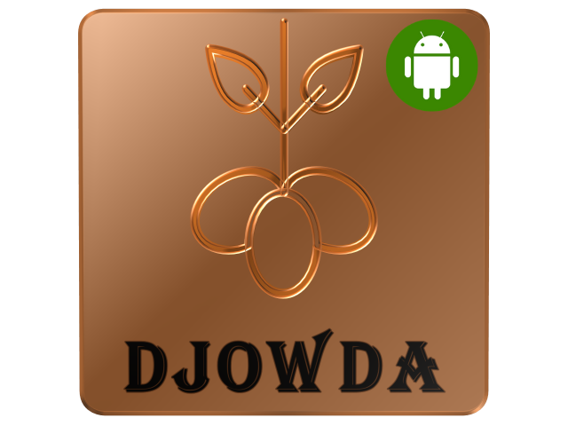
      </a>
       <a href="https://github.com/Moses-Code-Dev/Djowda-FarmerApp">Farmer App</a>
    </td>
    <td align="center">
      <a href="https://github.com/Moses-Code-Dev/Djowda-SeedProviderApp">
        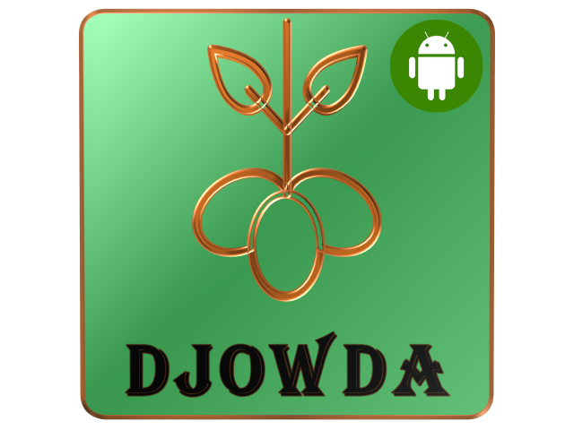
      </a>
       <a href="https://github.com/Moses-Code-Dev/Djowda-SeedProviderApp">App for Seed Providers</a>
    </td>
  </tr>
</table>
