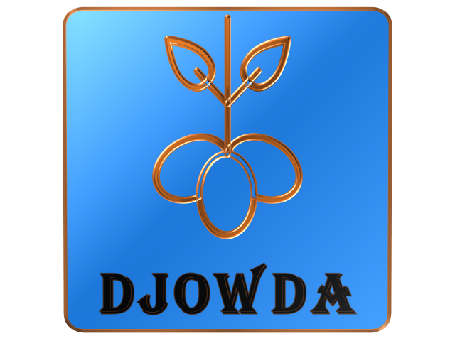
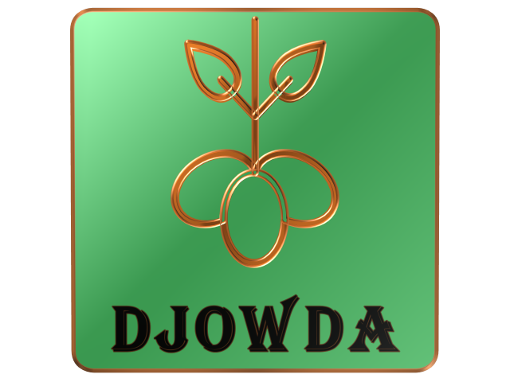

<!-- Banner Image -->
  

<!-- Project Description -->
**Djowda Project**  
*Driving the Future Together*  

Djowda is a decentralized e-grocery platform aimed at creating a robust network of fruit and vegetable stores across multiple locations. This project aims to address global food security by enabling real-time, distributed connectivity between stores, users, delivery personnel, and suppliers.

---

<!-- Grid of Apps -->
<table>
  <tr>
    <td align="center">
      
       User App
    </td>
    <td align="center">
      
       Delivery Men App
    </td>
    <td align="center">
      
       Store App
    </td>
    <td align="center">
      
       Store Admin App
    </td>
    <td align="center">
      
       Transport App
    </td>
  </tr>
  <tr>
    <td align="center">
      
       Restaurants App
    </td>
    <td align="center">
      
       Factory App
    </td>
    <td align="center">
      
       Whole Seller App
    </td>
    <td align="center">
      
       Farmer App
    </td>
    <td align="center">
      
       App for Seed Providers
    </td>
  </tr>
</table>
